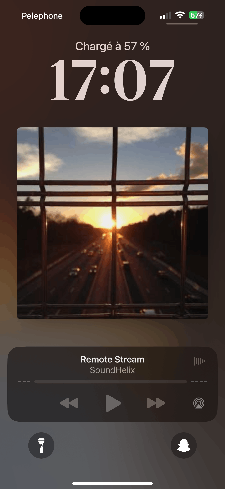
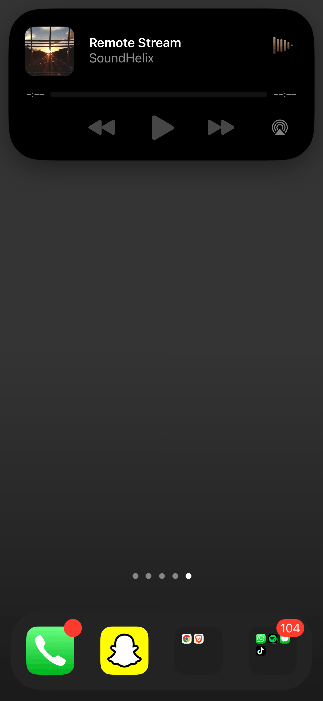
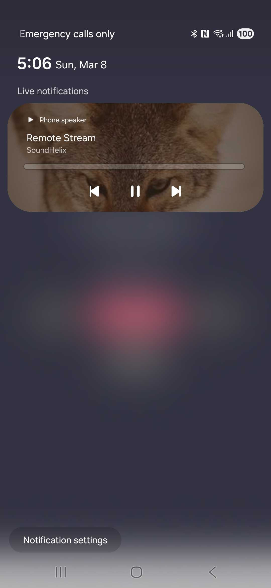

# react-native-media-session

Expose native media controls (iOS Lock Screen / Control Center, Android MediaStyle notification) to React Native. Built with [Nitro Modules](https://nitro.margelo.com/) for synchronous, type-safe native bridging.

Designed to coexist with any audio library — just wire up the remote commands to your player of choice.

<p align="center">
  
  
  
</p>

## Requirements

- React Native >= 0.76 (New Architecture)
- iOS >= 13.0
- Android minSdk >= 24

## Installation

```sh
npm install react-native-media-session react-native-nitro-modules
```

> `react-native-nitro-modules` is a required peer dependency.

### iOS setup

1. Install pods:

   ```sh
   cd ios && pod install
   ```

2. Enable **Background Modes** in Xcode:
   - Open your `.xcworkspace` in Xcode
   - Select your app target > **Signing & Capabilities**
   - Click **+ Capability** > **Background Modes**
   - Check **Audio, AirPlay, and Picture in Picture**

   Without this, the audio session will be interrupted when the app goes to background and lock screen controls won't appear.

### Android setup

The library declares `FOREGROUND_SERVICE` and `FOREGROUND_SERVICE_MEDIA_PLAYBACK` permissions in its own manifest — they are merged automatically.

If targeting Android 13+ (API 33), your app must request the `POST_NOTIFICATIONS` runtime permission to display the media notification:

```ts
import { PermissionsAndroid, Platform } from 'react-native';

if (Platform.OS === 'android' && Platform.Version >= 33) {
  await PermissionsAndroid.request(
    PermissionsAndroid.PERMISSIONS.POST_NOTIFICATIONS
  );
}
```

No other configuration is needed. The module uses autolinking.

## Usage

```ts
import { MediaSession } from 'react-native-media-session';

// 1. Set now-playing metadata
MediaSession.updateNowPlaying({
  title: 'Song Title',
  artist: 'Artist',
  album: 'Album',
  artwork: 'https://example.com/cover.jpg', // URL or local file path
  duration: 240,
  elapsedTime: 0,
  speed: 1.0,
});

// 2. Update playback state as the track progresses
MediaSession.updatePlaybackState('playing', 42, 1.0);

// 3. Listen to remote commands (lock screen / notification controls)
MediaSession.onRemotePlay(() => player.play());
MediaSession.onRemotePause(() => player.pause());
MediaSession.onRemoteStop(() => player.stop());
MediaSession.onRemoteNextTrack(() => player.next());
MediaSession.onRemotePreviousTrack(() => player.previous());
MediaSession.onRemoteSeek((position) => player.seekTo(position));

// 4. Clear metadata and disable controls when done
MediaSession.reset();
```

### Integration with react-native-nitro-sound

```ts
import { MediaSession } from 'react-native-media-session';
import Sound from 'react-native-nitro-sound';

// Start playback and set metadata
await Sound.startPlayer('https://example.com/track.mp3');
MediaSession.updateNowPlaying({
  title: 'Track',
  artist: 'Artist',
  album: 'Album',
  artwork: 'https://example.com/cover.jpg',
  duration: 0, // updated below once known
  elapsedTime: 0,
  speed: 1.0,
});

// Sync progress
Sound.addPlayBackListener((e) => {
  MediaSession.updatePlaybackState(
    'playing',
    e.currentPosition / 1000,
    1.0
  );
});

// Wire remote commands to the player
MediaSession.onRemotePlay(() => Sound.resumePlayer());
MediaSession.onRemotePause(() => Sound.pausePlayer());
MediaSession.onRemoteStop(() => Sound.stopPlayer());
MediaSession.onRemoteSeek((pos) => Sound.seekToPlayer(pos * 1000));
```

## API

### `updateNowPlaying(info: NowPlayingInfo)`

Set the metadata displayed on the lock screen / notification.

| Field | Type | Description |
| --- | --- | --- |
| `title` | `string` | Track title |
| `artist` | `string` | Artist name |
| `album` | `string` | Album name |
| `artwork` | `string` | Image URL or local file path (empty string = no artwork) |
| `duration` | `number` | Total duration in seconds |
| `elapsedTime` | `number` | Current position in seconds |
| `speed` | `number` | Playback rate (1.0 = normal) |

### `updatePlaybackState(state, elapsedTime, speed)`

Update the playback state and position. Call this regularly (e.g. from a playback progress listener) to keep the lock screen / notification in sync.

- `state`: `'playing' | 'paused' | 'stopped' | 'buffering'`
- `elapsedTime`: current position in seconds
- `speed`: playback rate

### `reset()`

Clear all metadata, disable remote commands, and remove the notification (Android).

### Remote command listeners

Register callbacks for lock screen / notification controls. Multiple callbacks can be registered per event.

| Method | Callback signature | Triggered by |
| --- | --- | --- |
| `onRemotePlay(cb)` | `() => void` | Play button |
| `onRemotePause(cb)` | `() => void` | Pause button |
| `onRemoteStop(cb)` | `() => void` | Stop button |
| `onRemoteNextTrack(cb)` | `() => void` | Next track button |
| `onRemotePreviousTrack(cb)` | `() => void` | Previous track button |
| `onRemoteSeek(cb)` | `(position: number) => void` | Seek bar (position in seconds) |

## Platform details

### iOS

- Uses `MPNowPlayingInfoCenter` and `MPRemoteCommandCenter`
- Configures `AVAudioSession` with `.playback` category for background audio
- Artwork loaded asynchronously via `URLSession` (remote URL) or `UIImage(contentsOfFile:)` (local path)

### Android

- Uses `MediaSessionCompat` with `NotificationCompat.MediaStyle`
- Creates a notification channel "Media Playback" (Android 8+)
- Notification includes previous / play-pause / next action buttons
- Artwork loaded asynchronously via `HttpURLConnection` (remote URL) or `BitmapFactory.decodeFile` (local path)
- Context is initialized automatically via a `ContentProvider` — no manual setup needed

## Contributing

- [Development workflow](CONTRIBUTING.md#development-workflow)
- [Sending a pull request](CONTRIBUTING.md#sending-a-pull-request)
- [Code of conduct](CODE_OF_CONDUCT.md)

## License

MIT

---

Made with [create-react-native-library](https://github.com/callstack/react-native-builder-bob)
